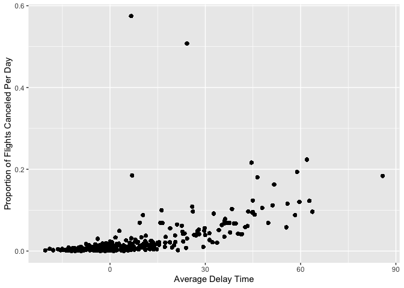

Homework Week 3 - Stat433
================
Emma Kim
9/27/2022

Answer the following questions with dplyr code in RMarkdown. Post the
answer into your github as a “nice readme” as explained in class.

1.  How many flights have a missing dep_time? What other variables are
    missing? What might these rows represent?

``` r
flights$dep_time %>% is.na() %>% sum()
```

    ## [1] 8255

``` r
names(which(colSums(is.na(flights))>8000))
```

    ## [1] "dep_time"  "dep_delay" "arr_time"  "arr_delay" "air_time"

8,255 flights have a missing dep_time. dep_delay, arr_time, arr_delay,
and air_time are also missing for some flights.

2.  Currently dep_time and sched_dep_time are convenient to look at, but
    hard to compute with because they’re not really continuous numbers.
    Convert them to a more convenient representation of number of
    minutes since midnight.

``` r
flights%>%
  mutate(useful_dep_time = 
           as.integer(dep_time/100) * 60 +
           (dep_time/100 - as.integer(dep_time/100)) * 100)%>%
  mutate(useful_sched_dep_time =
          as.integer(sched_dep_time/100) * 60 +
           (sched_dep_time/100 - as.integer(sched_dep_time/100)) * 100)%>%
  summarise(useful_dep_time, useful_sched_dep_time)
```

    ## # A tibble: 336,776 × 2
    ##    useful_dep_time useful_sched_dep_time
    ##              <dbl>                 <dbl>
    ##  1             317                   315
    ##  2             333                   329
    ##  3             342                   340
    ##  4             344                   345
    ##  5             354                   360
    ##  6             354                   358
    ##  7             355                   360
    ##  8             357                   360
    ##  9             357                   360
    ## 10             358                   360
    ## # … with 336,766 more rows

3.  Look at the number of canceled flights per day. Is there a pattern?
    Is the proportion of canceled flights related to the average delay?
    Use multiple dyplr operations, all on one line, concluding with
    ggplot(aes(x= ,y=)) + geom_point()

``` r
flights%>%
  group_by(month, day)%>%
  summarise(num_flights = n(),
            canceled = is.na(dep_time),
            prop_canceled = sum(canceled)/num_flights,
            avg_dep_delay = mean(dep_delay, na.rm=T),
            avg_arr_delay = mean(arr_delay, na.rm=T),
            avg_delay = mean(avg_arr_delay, avg_dep_delay))%>%
  ggplot(aes(x= avg_delay, y=prop_canceled)) +
  geom_point() +
  xlab("Average Delay Time") +
  ylab("Proportion of Flights Canceled Per Day") 
```

    ## `summarise()` has grouped output by 'month', 'day'. You can override using the
    ## `.groups` argument.

<!-- --> As the
average delay of a flight increases, the more likely it is to get
canceled.
